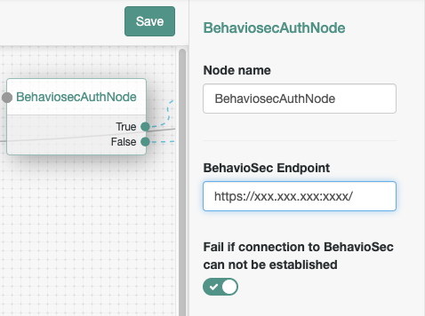

<!--
 * The contents of this file are subject to the terms of the Common Development and
 * Distribution License (the License). You may not use this file except in compliance with the
 * License.
 *
 * You can obtain a copy of the License at legal/CDDLv1.0.txt. See the License for the
 * specific language governing permission and limitations under the License.
 *
 * When distributing Covered Software, include this CDDL Header Notice in each file and include
 * the License file at legal/CDDLv1.0.txt. If applicable, add the following below the CDDL
 * Header, with the fields enclosed by brackets [] replaced by your own identifying
 * information: "Portions copyright [year] [name of copyright owner]".
 *
 * Copyright 2019 ForgeRock AS.
-->
# BehavioSec - Continues Authentication
The [BehavioSec platform][behaviosec_platform] provides a continuous and transparent sensory capability that helps verify that people online are who they say they are. It analyzes users’ keystrokes, cursor movements, screen pressure, and device handling to continuously authenticate users based on their innate behaviors in real time.
The system is invisible to end users. End users interact with the app in their normal ways, and their normal usage patterns are gathered.

In the background on the client app, the [BehavioSec SDK][behaviosec_platform]  collects data on how a user interacts with the app. A proxy mechanism on the backend passes the data to the BehavioSense Server, a machine learning framework, that then creates a user-specific Profile. Once a Profile is established, BehavioSense compares real-time data with previously saved data in the Profile. It analyzes the data to get an assessment of the similarity between the old and the new behavior. In this way BehavioSec can identify whether the user is the expected user. This analysis is reflected in the Behavioral Score, along with other results.

The platform can also identify behavioral patterns that may indicate a bot or RAT or other possibly malicious activity. In addition, it can capture non-behavioral descriptive data, such as IP addresses and mobile platform details, for additional types of analysis.

You can use the BehavioSec platform with any type of app where an end user inputs text, interacts with touch surfaces, or uses a mouse. An SDK captures the end user’s keystroke or pressure, swipes, etc. The system provides continuous authentication when multiple input fields and buttons throughout an app are instrumented.

## More information
Please familiarize with [BehavioSec SDK][behaviosec_platform] and ask customer support for deep dive in flag and configuration options.

## Authentication Tree 
Behaviosec provides all the neccesery componets to use [BehavioSec platform][behaviosec_platform] platform out the box. 

A sample of Authentication tree is shown below. Details for component configuration are in the following chapters.

## BehaviosecCollector
This is a data collector node that you need to place under the page node. In the configuration you have an option to add different collector script if needed.

## BehaviosecAuthNode
This node receives the collected data and communicates with the server. You have an option to fail authentication if connection to BehavioSense can not be established.

## BehavioSecScoreEvaluator
This is score evaluation module allowing you to specify score, confidence, and risk levels. 
Anything below specified values will fail. It also allows to control outcome for users that are still in training.

## BehavioSecBooleanEvaluator
Boolean evaluator controls the outcome for flags returned by BehavioSense module. Will fail on any mismatching condition.

## Installation

Please contact sales representative sales-xxx@forgerock.com
### Market space

### Binary
Download latest release from xxxxx and copy file to the ../web-container/webapps/openam/WEB-INF/lib directory where AM is deployed.  Restart the web container to pick up the new node.  The node will then appear in the authentication trees components palette.

The code in this repository has binary dependencies that live in the ForgeRock maven repository. Maven can be configured to authenticate to this repository by following the following [ForgeRock Knowledge Base Article](https://backstage.forgerock.com/knowledge/kb/article/a74096897).

# Disclaimer
        
The sample code described herein is provided on an "as is" basis, without warranty of any kind, to the fullest extent permitted by law. BehavioSec does not warrant or guarantee the individual success developers may have in implementing the sample code on their development platforms or in production configurations.

BehavioSec does not warrant, guarantee or make any representations regarding the use, results of use, accuracy, timeliness or completeness of any data or information relating to the sample code. BehavioSec disclaims all warranties, expressed or implied, and in particular, disclaims all warranties of merchantability, and warranties related to the code, or any service or software related thereto.

BehavioSec shall not be liable for any direct, indirect or consequential damages or costs of any type arising out of any action taken by you or others related to the sample code.

[forgerock_platform]: https://www.forgerock.com/platform/  
[behaviosec_platform]: https://www.behaviosec.com/  
