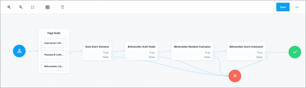
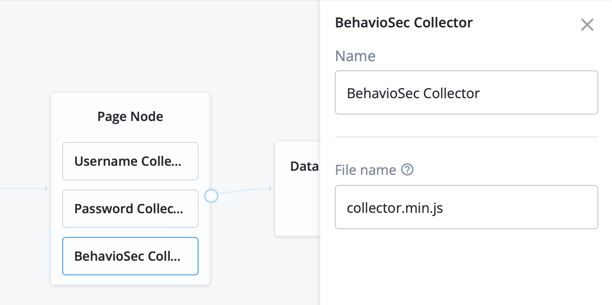

<!--
 * The contents of this file are subject to the terms of the Common Development and
 * Distribution License (the License). You may not use this file except in compliance with the
 * License.
 *
 * You can obtain a copy of the License at legal/CDDLv1.0.txt. See the License for the
 * specific language governing permission and limitations under the License.
 *
 * When distributing Covered Software, include this CDDL Header Notice in each file and include
 * the License file at legal/CDDLv1.0.txt. If applicable, add the following below the CDDL
 * Header, with the fields enclosed by brackets [] replaced by your own identifying
 * information: "Portions copyright [year] [name of copyright owner]".
 *
 * Copyright 2019 ForgeRock AS.
-->
# BehavioSec - Continuous Authentication

The [BehavioSec platform][behaviosec_platform] provides a continuous and transparent sensory capability that helps verify that people online are who they say they are. It analyzes users’ keystrokes, cursor movements, screen pressure, and device handling to continuously authenticate users based on their innate behaviors in real time.
The system is invisible to end users. End users interact with the app in their normal ways, and their normal usage patterns are gathered.

In the background on the client app, the [BehavioSec SDK][behaviosec_platform]  collects data on how a user interacts with the app. A proxy mechanism on the backend passes the data to the BehavioSense Server, a machine learning framework, that then creates a user-specific Profile. Once a Profile is established, BehavioSense compares real-time data with previously saved data in the Profile. It analyzes the data to get an assessment of the similarity between the old and the new behavior. In this way BehavioSec can identify whether the user is the expected user. This analysis is reflected in the Behavioral Score, along with other results.

The platform can also identify behavioral patterns that may indicate a bot or RAT or other possibly malicious activity. In addition, it can capture non-behavioral descriptive data, such as IP addresses and mobile platform details, for additional types of analysis.

You can use the BehavioSec platform with any type of app where an end user inputs text, interacts with touch surfaces, or uses a mouse. An SDK captures the end user’s keystroke or pressure, swipes, etc. The system provides continuous authentication when multiple input fields and buttons throughout an app are instrumented.

## Using BehavioSense for Continuous Authentication

Conventional approaches to security bring a need to choose between robust protections and streamlined user experience, and now there is a shift from these legacy systems to layered, adaptive approaches. BehavioSense is a layer in that security process that can authenticate users based on their own behaviors, using sophisticated data collection, without interrupting the user experience. BehavioSense provides passive verification and makes it more difficult for bad actors to mimic or compromise the security of the interaction.

For example, when an app's user types in various fields or clicks on various buttons, BehavioSense creates a Behavioral Score that indicates how close the user's behavioral patterns are to previously stored patterns. If BehavioSense indicates a low similarity score, an integrated application or third party security system can respond to that potential risk. If the low score is triggered on a login, for example, the system can respond with a step-up in authentication. The step-up can be a one-time password, security question, static biometric authenticator, or other threat-appropriate security measure defined by the customer's security infrastructure. Even after login, BehavioSense can analyze activity in other fields and buttons during a user session. Continuous authentication provides additional security when there is a risk of a device being compromised mid-session.

## Using BehavioSense for Fraud Detection and Analysis

BehavioSense is part of a multi-layered fraud analysis system. It adds dynamic behavioral biometrics to provide continuous user authentication. BehavioSense gathers and analyzes behavioral data and provides a Behavioral Score, among other metrics. The Behavioral Score indicates whether the current user is the same as the expected user. For more information about the metrics, see the BehavioSec documentation [Understanding Behavioral Scores and Metrics](https://developer.behaviosec.com/dw/scoring_and_metrics/).

In a conventional enterprise security system, the volume of alerts makes it difficult to distinguish false alarms from real risks. BehavioSense helps security teams to prioritize threats and improve efficiency in identifying breaches such as account takeovers, bots, or troll and spam accounts.

In the case of a fraudulent session, the system analyzes and identifies the characteristics of the fraud or breach type. A security team can see both an audit trail and fraud breakdown in the BehavioSense Dashboard Risk Flags, and/or use the BehavioSense REST API to pull the data into another security system component. 

Flags can include:
  * A change in IP address
  * A change in device during a session
  * A Remote Access Trojan (RAT) in the browser
  * Bot activity
  * Replay attacks
  * And more... see the BehavioSec documentation for [Risk Flags](https://developer.behaviosec.com/dw/risk_flags).

### More information
Please familiarize yourself with the [BehavioSec SDK][behaviosec_platform] and ask customer Support for a deep dive into the flag and configuration options.

# Installation

Download the latest release from <https://github.com/ForgeRock/BehavioSec/releases/latest> and copy file to the
 `../web-container/webapps/openam/WEB-INF/lib` directory where AM is deployed. Restart the
 web container to pick up the new node. The node will then appear in the authentication trees components palette.

The code in this repository has binary dependency on `behaviosec-iSDK-2.0-SNAPSHOT.jar`, contact forgerock@behaviosec
.com for access to the SDK. 

**Make sure to contact Sales Representative for licensing and tenant set up at forgerock@behaviosec.com.** 

## External Dependencies
behaviosec-iSDK-2.0-SNAPSHOT.jar
commons-logging-1.2.jar         
jackson-annotations-2.10.2.jar   
slf4j-api-1.7.13.jar
behaviosec-iSDK-2.0-SNAPSHOT.jar 
httpclient-4.5.11.jar            
jackson-core-2.10.2.jar          
slf4j-simple-1.7.13.jar                  
httpcore-4.4.13.jar              
jackson-databind-2.10.2.jar

## Configuration
The following sections provides information about configuring the BehavioSense tree. 

The BehavioSec API backend returns a JSON response that has been integrated to handle the outcome in ForgeRock Nodes. To
 start behavior metrics authentication follow these steps:

* Obtain the URL to the BehavioSense API endpoint, dashboard URL, and get access to developer portal documentation.
* Create a user with an email address and real password (see Note 1).
* Combine the components as show in the Authentication Tree.
* Save.
* Navigate to the login page with the tree URL + `#login&service=BehavioSec`.
* Login in as the user.
* Verify with the BehavioSense Dashboard recorded session. 

Note 1: BehavioSec machine learning is developed on real scenarios, therefore it is highly recommended to use more than 8 characters each for the user name and password. 

## On profile training

## Authentication Tree 
BehavioSec provides all the necessary components to use the [BehavioSec platform][behaviosec_platform] platform out the box. 

A sample of the Authentication Tree is shown below. Details for component configuration are in the following sections. Naturally, **Failure** outcomes should result in authentication step up, retry, or even account lock out.

## BehavioSec Collector
This is a data collector node that you need to place under the page node. In the configuration you have an option to add a different collector script if needed.

## BehavioSec AuthNode
This node receives the collected data and communicates with the server. 

### Options
*BehavioSec Endpoint* - if set to true, the username will be hashed using `Hashing.sha256()`

*Tenant ID* - if set to true, the username will be hashed using `Hashing.sha256()`

*Hash username* - if set to true, the username will be hashed using `Hashing.sha256()`

*Anonymize IP* - if set to true, set last octet of IP address to 000. 

*Fail if no connection*  - option allows node evaluation to true even if the connection to BehavioSense was not
 established.
 

## BehavioSec Score Evaluator
This Score evaluation module allows you to specify the Behavioral Score, Confidence, and Risk levels. 
Anything below the specified values will fail. It also allows you to control the outcome for users whose Profiles are still in the Training phase.

* **Behavioral Score** or Score is a numerical value ranging from 0 to 100, that indicates to what
 degree the timing data in the session matches the timing data in the trained Profile. A high Behavioral Score means
  there is little difference between the behavior in the session and the user’s Profile. [Read more about the Behavioral Score](https://developer.behaviosec.com/dw/scoring_and_metrics#behavioral_score).

* **Confidence** is a value that represents the quantity of data that has been stored in a Profile and is available to check
 against the user. The higher the Confidence value, the more data is available to check against the behavior
  presented in a given session. [Read more about the Confidence value](https://developer.behaviosec.com/dw/scoring_and_metrics#confidence).
  
* **Risk** is a numerical measure of potentially fraudulent activity during the course of a user session. It can be a
 number greater than or equal to zero. A Risk value in the range of 0-100 is considered minimal risk, while over 100
  is high risk and should be investigated for fraud. [Read more about the Risk value](https://developer.behaviosec.com/dw/scoring_and_metrics#risk).

* **Allow In Training** indicates that the user Profile is still in the Training phase. If enabled, the Score and Risk
 will be ignored and the node will evaluate to true. 

## BehavioSec Boolean Evaluator
The Boolean evaluator controls the outcome for flags returned by the BehavioSense module. It will fail on any
 condition evaluating to false.

### Boolean Flag configuration
* **Bot Detection**	indicates that robotic behavior was detected, such as a typing rhythm that is too uniform or
 jittery mouse movements. This information is received from the isBot flag in the JSON. **Allow Auto-Login Bot** enabled
  evaluates to a true outcome even if a bot is detected. Default is **false**.
* **Replay Attack**	indicates that the exact same behavioral data has been received in the past. This information is
 received from the isReplay flag. **Allow Replay** enabled evaluates to a true outcome even if replay is detected. Default is **false**.
* **Allow In Training**	indicates that the user Profile is still in the Training phase. If enabled, the Score and
 Risk will be ignored and the node will evaluate to true. 
* **Remote Access**	indicates that one or more remote access protocols were detected in the session. If remote access
 has been flagged, you can see a breakdown of software using the detected protocols by looking at the
  ratProtocol parameter. **Allow Remote Access** enabled evaluates to a true outcome even if a remote access protocol is
   detected. Default is **true**.
* **Tab Anomaly** indicates the the user has inconsistent tabbing behavior. This information is received from the
 tabAnomaly flag in the JSON. **Allow Tab Anomaly** enabled evaluates to a true outcome even if a tab anomaly is detected. Default is **true**.
* **Numpad Anomaly** indicates that the user has inconsistent numeric keypad behavior. This information is
 received from the numpadAnomaly flag in the JSON.  **Allow Numpad Anomaly** enabled evaluates to a true outcome even if
  a numpad anomaly is detected. Default is **true**.
* **Device Changed** indicates that the device/user agent string has changed during the active session. When a new device
 type is detected (e.g., Desktop, Android, or iOS device), this flag is set to true. This information is received
  from the deviceChanged flag in the JSON.  **Allow Device Change** enabled evaluates to a true outcome even if a device
   change is detected. Default is **true**.
* **IP Changed** indicates if the IP has changed since previous sessions and will also provide a severity value depending on usage frequency. This information is received
  from the ipChanged flag in the JSON.  **Allow IP Change** enabled evaluates to a true outcome even if a device
   change is detected. Default is **true**.
* **Copy-Paste** indicates that the user copied or pasted into username or password field during the active session. This information is received
  from the diDesc flag in the JSON.  **Allow Copy-Paste Change** enabled evaluates to a true outcome even if a device
   change is detected. Default is **true**.
   
For full list of available flags please see the BehavioSec documentation for [Risk Flags](https://developer.behaviosec.com/dw/risk_flags).

# Whats new in version 2
Version 2 brings multiple improvements based on customer feedback. We add support for BehavioSense 5.2 and a multitenant environment. 

Additionally, configuration for new Risk flags: "Copy-Paste" and "IP Change". See the extended information above.

# Disclaimer
        
The sample code described herein is provided on an "as is" basis, without warranty of any kind, to the fullest extent permitted by law. BehavioSec does not warrant or guarantee the individual success developers may have in implementing the sample code on their development platforms or in production configurations.

BehavioSec does not warrant, guarantee or make any representations regarding the use, results of use, accuracy, timeliness or completeness of any data or information relating to the sample code. BehavioSec disclaims all warranties, expressed or implied, and in particular, disclaims all warranties of merchantability, and warranties related to the code, or any service or software related thereto.

BehavioSec shall not be liable for any direct, indirect or consequential damages or costs of any type arising out of any action taken by you or others related to the sample code.

[forgerock_platform]: https://www.forgerock.com/platform/  
[behaviosec_platform]: https://www.behaviosec.com/  
