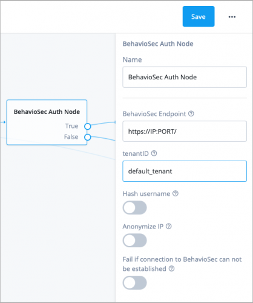
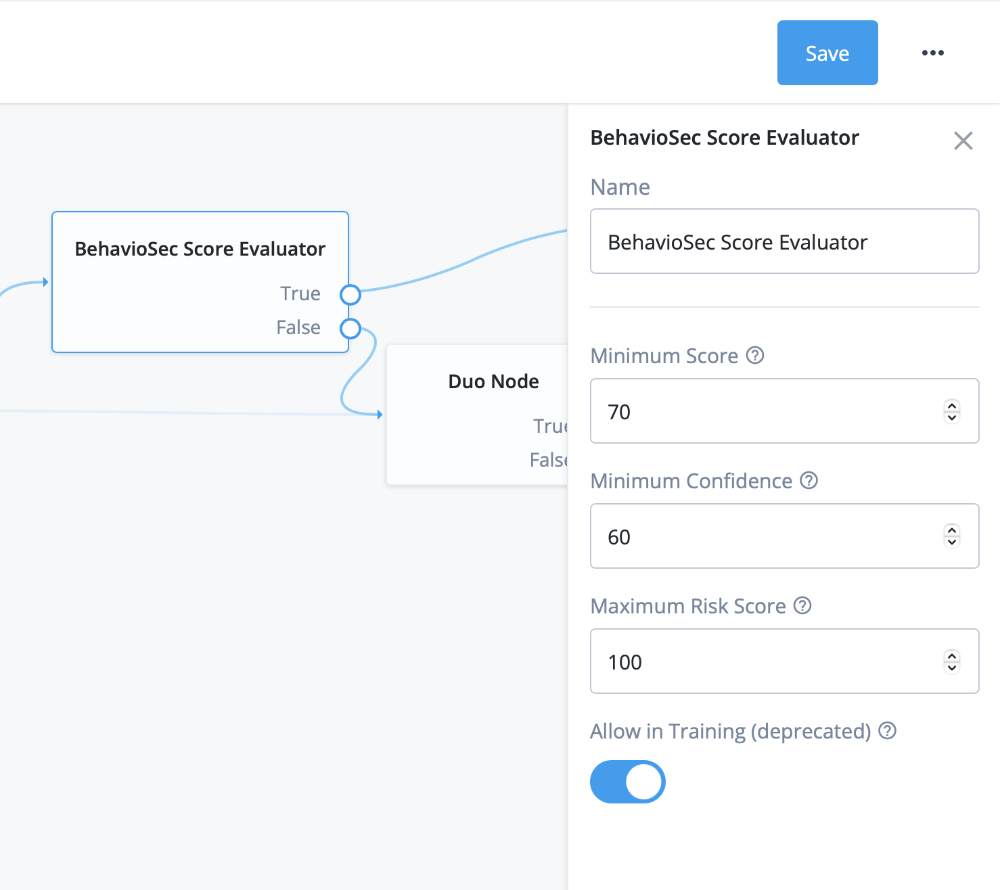
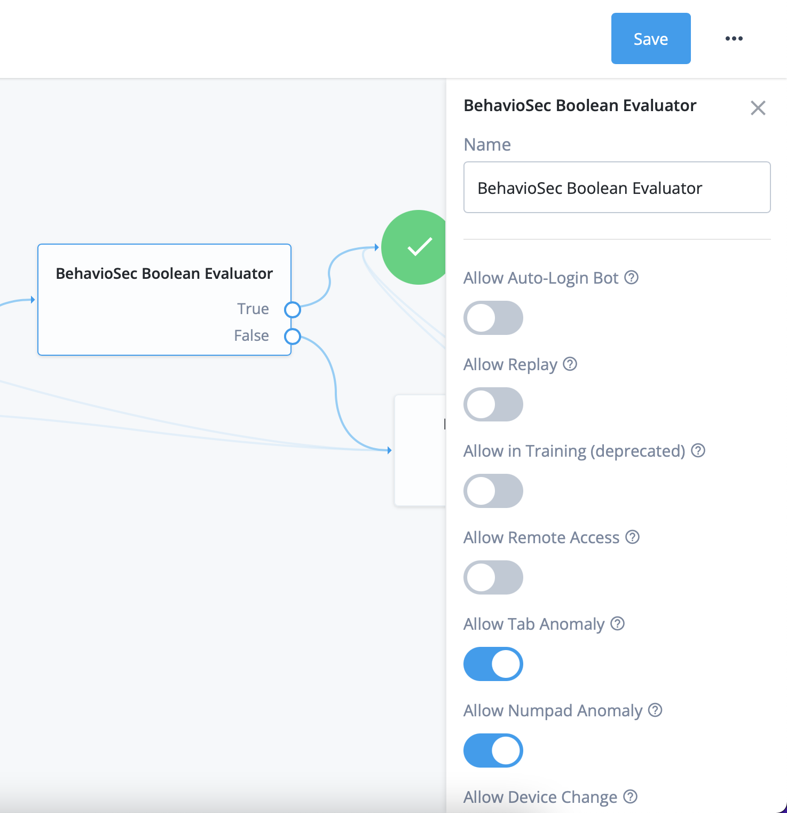

<!--
 * The contents of this file are subject to the terms of the Common Development and
 * Distribution License (the License). You may not use this file except in compliance with the
 * License.
 *
 * You can obtain a copy of the License at legal/CDDLv1.0.txt. See the License for the
 * specific language governing permission and limitations under the License.
 *
 * When distributing Covered Software, include this CDDL Header Notice in each file and include
 * the License file at legal/CDDLv1.0.txt. If applicable, add the following below the CDDL
 * Header, with the fields enclosed by brackets [] replaced by your own identifying
 * information: "Portions copyright [year] [name of copyright owner]".
 *
 * Copyright 2021 ForgeRock AS.
-->
# BehavioSec - Continuous Authentication

The [BehavioSec platform][behaviosec_platform] provides a continuous and transparent sensory capability that helps verify that people online are who they say they are. It analyzes users’ keystrokes, cursor movements, screen pressure, and device handling to continuously authenticate users based on their innate behaviors in real time.
The system is invisible to end users. End users interact with the app in their normal ways, and their normal usage patterns are gathered.

In the background on the client app, the [BehavioSec SDK][behaviosec_platform]  collects data on how a user interacts with the app. A proxy mechanism on the backend passes the data to the BehavioSense Server, a machine learning framework, that then creates a user-specific Profile. Once a Profile is established, BehavioSense compares real-time data with previously saved data in the Profile. It analyzes the data to get an assessment of the similarity between the old and the new behavior. In this way BehavioSec can identify whether the user is the expected user. This analysis is reflected in the Behavioral Score, along with other results.

The platform can also identify behavioral patterns that may indicate a bot or RAT or other possibly malicious activity. In addition, it can capture non-behavioral descriptive data, such as IP addresses and mobile platform details, for additional types of analysis.

You can use the BehavioSec platform with any type of app where an end user inputs text, interacts with touch surfaces, or uses a mouse. An SDK captures the end user’s keystroke or pressure, swipes, etc. The system provides continuous authentication when multiple input fields and buttons throughout an app are instrumented.

## Using BehavioSense for Continuous Authentication
Conventional approaches to security bring a need to choose between robust protections and streamlined user experience, and now there is a shift from these legacy systems to layered, adaptive approaches. BehavioSense is a layer in that security process that can authenticate users based on their own behaviors, using sophisticated data collection, without interrupting the user experience. BehavioSense provides passive verification and makes it more difficult for bad actors to mimic or compromise the security of the interaction.

For example, when an app's user types in various fields or clicks on various buttons, BehavioSense creates a Behavioral Score that indicates how close the user's behavioral patterns are to previously stored patterns. If BehavioSense indicates a low similarity score, an integrated application or third-party security system can respond to that potential risk. If the low score is triggered on a login, for example, the system can respond with a step-up in authentication. The step-up can be a one-time password, security question, static biometric authenticator, or other threat-appropriate security measure defined by the customer's security infrastructure. Even after login, BehavioSense can analyze activity in other fields and buttons during a user session. Continuous authentication provides additional security when there is a risk of a device being compromised mid-session.

## Using BehavioSense for Fraud Detection and Analysis
BehavioSense is part of a multi-layered fraud analysis system. It adds dynamic behavioral biometrics to provide continuous user authentication. BehavioSense gathers and analyzes behavioral data and provides a Behavioral Score, among other metrics. The Behavioral Score indicates whether the current user is the same as the expected user. For more information about the metrics, see the BehavioSec documentation [Understanding Behavioral Scores and Metrics](https://developer.behaviosec.com/dw/scoring_and_metrics/).

In a conventional enterprise security system, the volume of alerts makes it difficult to distinguish false alarms from real risks. BehavioSense helps security teams to prioritize threats and improve efficiency in identifying breaches such as account takeovers, bots, or troll and spam accounts.

In the case of a fraudulent session, the system analyzes and identifies the characteristics of the fraud or breach type. A security team can see both an audit trail and fraud breakdown in the BehavioSense Dashboard Risk Flags, and/or use the BehavioSense REST API to pull the data into another security system component.

Flags can include:
* A change in IP address
* A change in device during a session
* A Remote Access Trojan (RAT) in the browser
* Bot activity
* Replay attacks
* And more... see the BehavioSec documentation for [Risk Flags](https://developer.behaviosec.com/dw/flags/flags_at_a_glance).

### More information
Please familiarize yourself with the [BehavioSec SDK][behaviosec_platform] and ask customer Support for a deep dive into the flag and configuration options.

# Installation
Download the latest release from <https://github.com/ForgeRock/BehavioSec/releases/latest> and copy the file to the
`../web-container/webapps/openam/WEB-INF/lib` directory where AM is deployed. Restart the
web container to pick up the new node. The node will then appear in the authentication trees components palette.

The code in this repository has binary dependencies that live in the ForgeRock maven repository. Maven can be configured to authenticate to this repository by following the following [ForgeRock Knowledge Base Article](https://backstage.forgerock.com/knowledge/kb/article/a74096897).

Make sure to contact Sales Representative for licensing.

## Configuration
The following section provides information about configuring the BehavioSense tree.

The BehavioSec API backend returns a JSON response that has been integrated to handle the outcome in ForgeRock Nodes. To start behavior metrics authentication follow these steps:

1. Obtain the URL to the BehavioSense API endpoint, Dashboard URL, and get access to developer portal documentation.
2. Create a user with an email address and real password (see Note 1).
3. Combine the components as show in the Authentication Tree.
4. Save.
5. Navigate to the login page with the tree URL + `?authIndexType=service&authIndexValue=BehavioSec`.
6. Login in as the user.
7. Verify with the BehavioSense Dashboard recorded session.

Note 1: BehavioSec machine learning is developed on real scenarios. Therefore, it is highly recommended to use more than 8 characters each for the username and password.

## Authentication Tree
BehavioSec provides all the necessary components to use the [BehavioSec platform][behaviosec_platform] out the box.

A sample of the Authentication Tree is shown below. Details for component configuration are in the following sections. Naturally, **Failure** outcomes should result in authentication step up, retry, or even account lockout.

## BehavioSec Collector
This is a data collector node that you need to place under the page node. In the configuration you have an option to add a different collector script if needed.

When using the old user interface (UI), use collector.min.65.js instead of the default, collector.min.js.

## BehavioSec AuthNode
This node receives the collected data and communicates with the server.

### Options
*Hash username* - if set to `true`, the username will be hashed using `Hashing.sha256()`

*Anonymize IP* - if set to `true`, last octet of the IP address will be set to 000.

*Fail if no connection*  - option allows node evaluation to `true` even if the connection to BehavioSense was not established.

## BehavioSec Score Evaluator
This Score evaluation module allows you to specify the Behavioral Score, Confidence, and Risk levels. Anything below the specified values will fail. It also allows you to control the outcome for users whose Profiles are still in the Training phase.

* **Behavioral Score** or Score is a numerical value ranging from 0 to 100, that indicates to what
  degree the timing data in the session matches the timing data in the trained Profile. A high Behavioral Score means there is little difference between the behavior in the session and the user’s Profile. [Read more about the Behavioral Score](https://developer.behaviosec.com/dw/scoring_and_metrics#behavioral_score).

* **Confidence** is a value that represents the quantity of data that has been stored in a Profile and is available to check against the user. The higher the Confidence value, the more data is available to check against the behavior presented in a given session. [Read more about the Confidence value](https://developer.behaviosec.com/dw/scoring_and_metrics#confidence).

* **Risk** is a numerical measure of potentially fraudulent activity during the course of a user session. It can be a number greater than or equal to zero. A Risk value in the range of 0 to 100 is considered minimal risk, while over 100 is high risk and should be investigated for fraud. [Read more about the Risk value](https://developer.behaviosec.com/dw/scoring_and_metrics#risk).

* **Allow In Training** indicates that the User Profile is still in the Training phase. If enabled, the Score and Risk will be ignored and the node will evaluate to `true`. [Read more about Training](https://developer.behaviosec.com/dw/training).

## BehavioSec Boolean Evaluator
The Boolean evaluator controls the outcome for flags returned by the BehavioSense module. It will fail on any condition evaluating to `false`.

### Boolean Flag configuration
* **Bot Detection**	indicates that robotic behavior was detected, such as a typing rhythm that is too uniform or jittery mouse movements. This information is received from the `isBot` flag in the JSON. **Allow Auto-Login Bot** enabled evaluates to a `true` outcome even if a bot is detected. Default is `false`.
* **Replay Attack**	indicates that the exact same behavioral data has been received in the past. This information is received from the `isReplay` flag. **Allow Replay** enabled evaluates to a true outcome even if replay is detected. Default is `false`.
* **Allow In Training**	indicates that the user Profile is still in the Training phase. If enabled, the Score and Risk will be ignored, and the node will evaluate to `true`.
* **Remote Access**	indicates that one or more remote access protocols were detected in the session. If remote access has been flagged, you can see a breakdown of software using the detected protocols by looking at the `ratProtocol` parameter. **Allow Remote Access** enabled evaluates to a `true` outcome even if a remote access protocol is detected. Default is `true`.
* **Tab Anomaly** indicates that the user has inconsistent tabbing behavior. This information is received from the `tabAnomaly` flag in the JSON. **Allow Tab Anomaly** enabled evaluates to a `true` outcome even if a tab anomaly is detected. Default is `true`.
* **Numpad Anomaly** indicates that the user has inconsistent numeric keypad behavior. This information is received from the `numpadAnomaly` flag in the JSON. **Allow Numpad Anomaly** enabled evaluates to a `true` outcome even if a numpad anomaly is detected. Default is `true`.
* **Device Changed** indicates that the device/user agent string has changed during the active session. When a new device type is detected (e.g., Desktop, Android, or iOS device), this flag is set to `true`. This information is received from the `deviceChanged` flag in the JSON.  **Allow Device Change** enabled evaluates to a true outcome even if a device change is detected. Default is `true`.

For a complete list of available flags, see the BehavioSec documentation for [Risk Flags](https://developer.behaviosec.com/dw/flags/flags_at_a_glance).

# Continuous Authentication
In addition to being able to use BehavioSec for login, the continuous authentication node allows you to use the BehavioSec SDK on any ForgeRock protected page where you need to collect data.

## Prerequisites
The continuous authentication node requires that a policy enforcement point (PEP) intercepting traffic to the application be already configured. You can use ForgeRock Java Agents, Web Agents, and Identity Gateway as PEPs with the continuous authentication node.

## Configuration
The following steps describe the basic setup of a Java agent and a web application for continuous authentication. For BehavioSec-specific steps, see step 3 and following.

### Step 1: Set up a Policy in ForgeRock AM

1. Create a policy.
   1. In the AM console, navigate to Realms > Realm Name > Authorization > Policy Sets > Default Policy Set.
   2. Click **Add a Policy**, and provide Name, Resource Type, and Resources for the policy.
      * **Name:** Banking 
      * **Resource Type:** URL
      * **Resources:** http://app.example.com:8080/Banking/*
   3. Click **Create**.

2. Add an action to the policy.
    1. Select the Actions tab.
    2. Click **Add an Action**. 
    3. Select **Get**.
    4. Click **Save Changes**.

3. Define the subjects that the policy applies to.
   1. Select the Subjects tab.
   2. Click **Add a Subject Condition**.
   3. From the **Type** drop-down menu, select **Authenticated Users**.
   4. Click **Save Changes**.

The final policy should look like this:

### Step 2: Add the Policy to a Java Agent

1. In the AM console, navigate to Realms > Realm Name > Applications > Agents > Java Agent.
2. Select an existing Java Agent.
3. In the Global tab, go to the Agent Filter Mode section and add a new mode with:
   * Key: "Banking"
   * Value: "URL_POLICY"
4. Click **Save Changes**.

### Step 3: Add the Provided SDK to the Required Pages
The only required change to the web application is to add the SDK to the form submitting web pages that are going to collect behavioral data:

	    

This can be done on the individual pages or at the framework level.

### Step 4: Create an Authentication Tree using the Continuous Authentication Node
The BehavioSec Continuous Authentication node, just like the BehavioSec Auth Node, receives the collected data and communicates with the server.

### Step 5: Set up One More Policy in ForgeRock AM
Configure a policy that invokes the Authentication Tree created in the previous step when data is posted by the page that contains the BehavioSec SDK.

Access Manager provides access management, which consists of authentication and authorization. Whether access is granted depends on the access policies.

To enable the collection of the behavioral data by the Authentication Tree, you need to configure policy sets to protect the pages.

1. Create a policy.
   1. In the AM console, navigate to Realms > Realm Name > Authorization > Policy Sets > Default Policy Set.
   2. Click **Add a Policy**, and provide Name, Resource Type, and Resources for the policy.
      * Name: BankingContinuous
      * Resource Type: URL
      * Resources: http://app.example.com:8080/Banking/post*
   3. Click **Create**.

2. Add an action.
   1. Select the Actions tab.
   2. Click **Add an Action**.
   3. Select **Post**.
   4. Click **Save Changes**.

3. Define the subjects that the policy applies to.
   1. Select the Subjects tab.
   2. Click **Add a Subject Condition**.
   3. From the **Type** drop-down menu, select **Authenticated Users**.
   4. Click **Save Changes**.

4. Configure the environment conditions.
   1. Select the Environments tab.
   2. Click **Add an Environment Condition**.
   3. From the **Type** drop-down menu, select **Transaction**.
   4. Set **Authentication Strategy** to **Authenticate To Tree**.
   5. Set **Strategy Specifier** to **Continuous**.
   6. Click **Save Changes**.

The final policy should look like this:

### Step 6: Add the Policy to a Java Agent

1. In the AM console, navigate to Realms > Realm Name > Applications > Agents > Java Agent.
2. Select an existing Java Agent.
3. In the Global tab, go to Agent Filter Mode and add a new mode with:
    * Key: "BankingContinuous"
    * Value: "URL_POLICY"
5. Click **Save Changes**.

For more information on applications, see https://backstage.forgerock.com/docs/am/7/security-guide/protecting-applications.html.

# Disclaimer
The sample code described herein is provided on an "as is" basis, without warranty of any kind, to the fullest extent permitted by law. BehavioSec does not warrant or guarantee the individual success developers may have in implementing the sample code on their development platforms or in production configurations.

BehavioSec does not warrant, guarantee or make any representations regarding the use, results of use, accuracy, timeliness or completeness of any data or information relating to the sample code. BehavioSec disclaims all warranties, expressed or implied, and in particular, disclaims all warranties of merchantability, and warranties related to the code, or any service or software related thereto.

BehavioSec shall not be liable for any direct, indirect or consequential damages or costs of any type arising out of any action taken by you or others related to the sample code.

[forgerock_platform]: https://www.forgerock.com/platform/
[behaviosec_platform]: https://www.behaviosec.com/  
